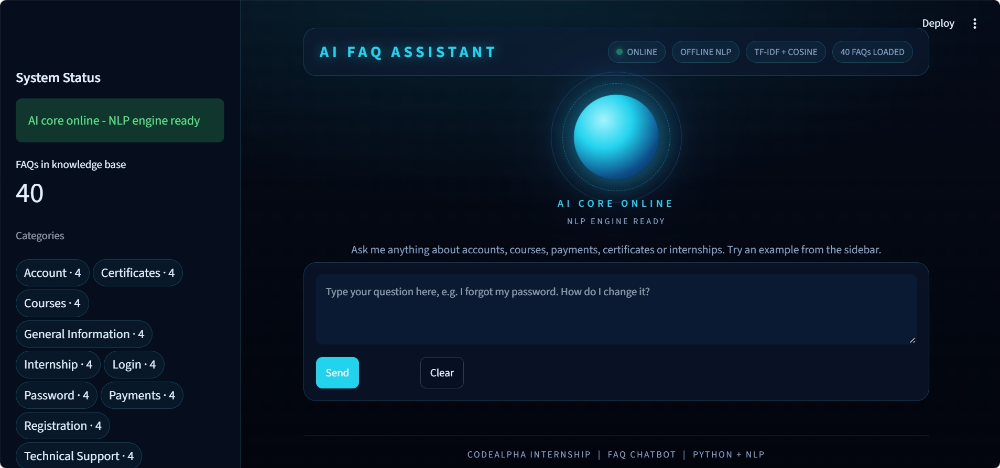
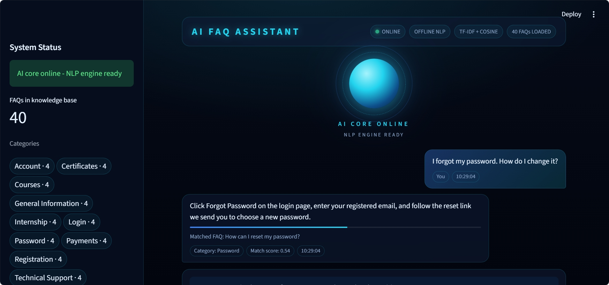
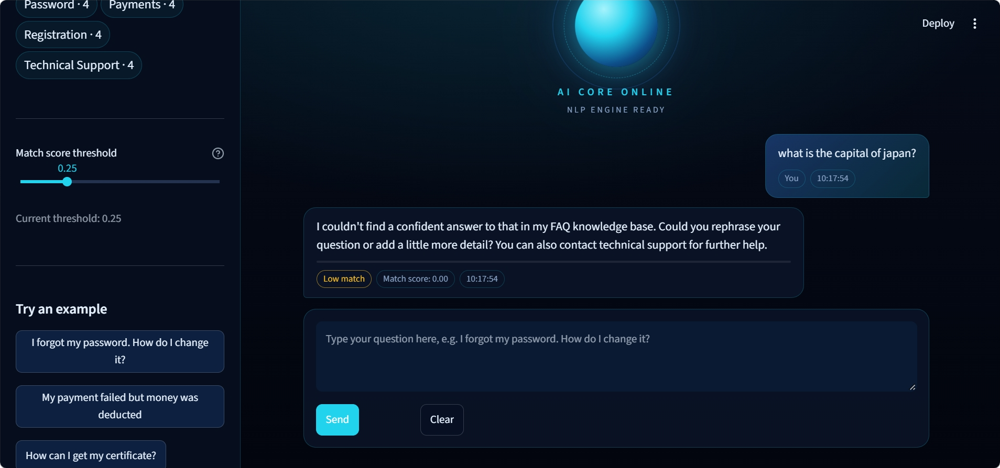

# CodeAlpha FAQ Chatbot

An offline FAQ chatbot that I built for **CodeAlpha Internship - Task 2**. It understands questions that are worded
differently from the stored FAQs, finds the best match using **TF-IDF and cosine similarity**, shows a match score,
and replies with a safe fallback instead of guessing. The interface is a dark, futuristic AI-assistant dashboard
made with Streamlit.

---

## Project Overview

I wanted to build a chatbot that is reliable and easy to explain, so I used classic NLP rather than an external AI
service. Everything runs locally: no API keys, no internet connection and no hidden costs. Every answer comes from a
curated FAQ knowledge base, so the bot never makes up information.

## Problem Statement

Support teams answer the same questions again and again, and users phrase them in many different ways
("How do I reset my password?" vs "I forgot my password, how do I change it?"). This project matches free-text
questions to the right FAQ automatically, and says so honestly when it is not confident enough to answer.

## Features

- **Natural-language matching:** different wording still finds the right FAQ
- **Match score and category** shown with every answer
- **Adjustable threshold:** a sidebar slider controls how strict the matching is
- **Safe fallback response** when confidence is low (no hallucinated answers)
- **Conversation history** with timestamps, and a Clear button (Streamlit `session_state`)
- **Input validation:** handles empty, whitespace-only, symbol-only and over-long input (500 characters max)
- **Dataset validation:** friendly errors for a missing file, invalid JSON, an empty list, bad records and duplicate ids
- **Fast repeated queries:** the TF-IDF index is built once (`st.cache_resource`) plus a small in-memory result cache
- **100% offline** after installation
- **44 automated tests** with pytest

## Technology Stack

| Area | Tools |
|---|---|
| Language | Python 3.9+ (tested on Python 3.12) |
| UI | Streamlit |
| NLP / ML | scikit-learn (TF-IDF, cosine similarity) |
| Data | JSON (40 FAQs, 10 categories) |
| Testing | pytest |

I deliberately did not use NLTK. A small built-in stop-word list and a light stemmer are enough for this project and
avoid extra downloads.

## Architecture

```
User question
   -> Input validation          (processor.validate_question)
   -> Normalization / cleaning  (processor.preprocess)
   -> TF-IDF vectorization      (matcher.FAQMatcher, fitted once)
   -> Cosine similarity         (against every FAQ vector)
   -> Best match + threshold    (configurable)
   -> Answer  OR  fallback
```

The business logic lives in the `chatbot/` package. `app.py` only handles the interface and session state, which keeps
the code clean and easy to test.

## How the NLP System Works

**1. Preprocessing.** The text is lowercased, punctuation and apostrophes are removed, common stop words
("how", "do", "my") are dropped, and a light suffix stripper makes "certificates" and "certificate" the same term.

**2. TF-IDF (Term Frequency - Inverse Document Frequency).** Each FAQ (its question plus keywords) becomes a numeric
vector. A word gets a higher weight when it is frequent in one FAQ but rare across all FAQs, so distinctive words like
"refund" or "certificate" count for more than common ones. I use unigrams and bigrams with sublinear term frequency.

**3. Cosine similarity.** This measures the angle between the question vector and each FAQ vector:

```
cos(a, b) = (a . b) / (|a| * |b|)
```

The result runs from 0 (nothing in common) to 1 (identical wording). The best FAQ is returned only if its score
reaches the threshold (default **0.25**).

> The **match score** is a similarity measure, not the probability that the answer is correct.

## Project Structure

```
CodeAlpha_FAQChatbot/
|-- app.py                  # Streamlit UI
|-- chatbot/
|   |-- __init__.py         # Public API of the package
|   |-- data_loader.py      # JSON loading + validation
|   |-- processor.py        # Input validation + text preprocessing
|   `-- matcher.py          # TF-IDF index, cosine similarity, fallback
|-- data/
|   `-- faqs.json           # Local FAQ knowledge base
|-- tests/
|   `-- test_chatbot.py     # pytest suite
|-- assets/                 # Screenshots used in this README
|-- .streamlit/
|   `-- config.toml         # Dark theme (no secrets)
|-- requirements.txt
|-- .gitignore
`-- README.md
```

## Installation

**Windows (PowerShell):**

```powershell
python -m venv .venv
.\.venv\Scripts\Activate.ps1
python -m pip install --upgrade pip
pip install -r requirements.txt
```

If PowerShell blocks activation, run this once: `Set-ExecutionPolicy -Scope CurrentUser RemoteSigned`

**macOS / Linux:**

```bash
python3 -m venv .venv && source .venv/bin/activate && pip install -r requirements.txt
```

> Tip: use Python 3.12 or 3.11. Very new Python versions may not have pre-built packages for all dependencies yet.

## How to Run

```powershell
streamlit run app.py
```

The app opens at http://localhost:8501.

## How to Test

```powershell
pytest -q
```

Expected result: `44 passed`.

## Example Questions

- I forgot my password. How do I change it?
- My payment failed but money was deducted
- How can I get my certificate?
- What is the internship duration?
- Why can't I log in?
- Is there an Android app?

## Fallback Behavior

If the best match score is below the threshold (or the question has no meaningful words), the bot does **not** guess.
It replies with a polite fallback message, shows the low match score, and suggests the closest FAQs when available.
Example: asking "What is the capital of France?" returns the fallback, because it is outside the knowledge base.

## Performance Considerations

- The TF-IDF vectorizer and FAQ matrix are built once and cached with `st.cache_resource`
  (and rebuilt automatically when `faqs.json` is edited).
- Each question needs only one vector transform and one sparse similarity computation.
- Repeated questions are served from a small thread-safe LRU cache.
- CSS animations are lightweight and are disabled for users who prefer reduced motion.

## Screenshots

**Home screen**



**Matched answer with category and match score**



**Fallback response for an unrelated question**



## What I Learned

- Building an NLP pipeline with TF-IDF and cosine similarity
- Designing a clean, modular Python project and separating logic from the UI
- Validating data and user input, and handling errors gracefully
- Writing automated tests with pytest
- Building an interactive interface with Streamlit
- Publishing and documenting a project on GitHub

## Future Improvements

- Admin page to add and edit FAQs
- Word embeddings or sentence transformers for deeper semantic matching
- Multi-language support
- Feedback buttons to improve ranking
- Docker image and CI workflow

## Internship Information

Developed as part of the **CodeAlpha Internship - Task 2: FAQ Chatbot**.

## Author

**A. Mohamed Musthafa**

- GitHub: [MohamedMusthafa07](https://github.com/MohamedMusthafa07)
- LinkedIn: [mohamedmusthafa07](https://www.linkedin.com/in/mohamedmusthafa07)